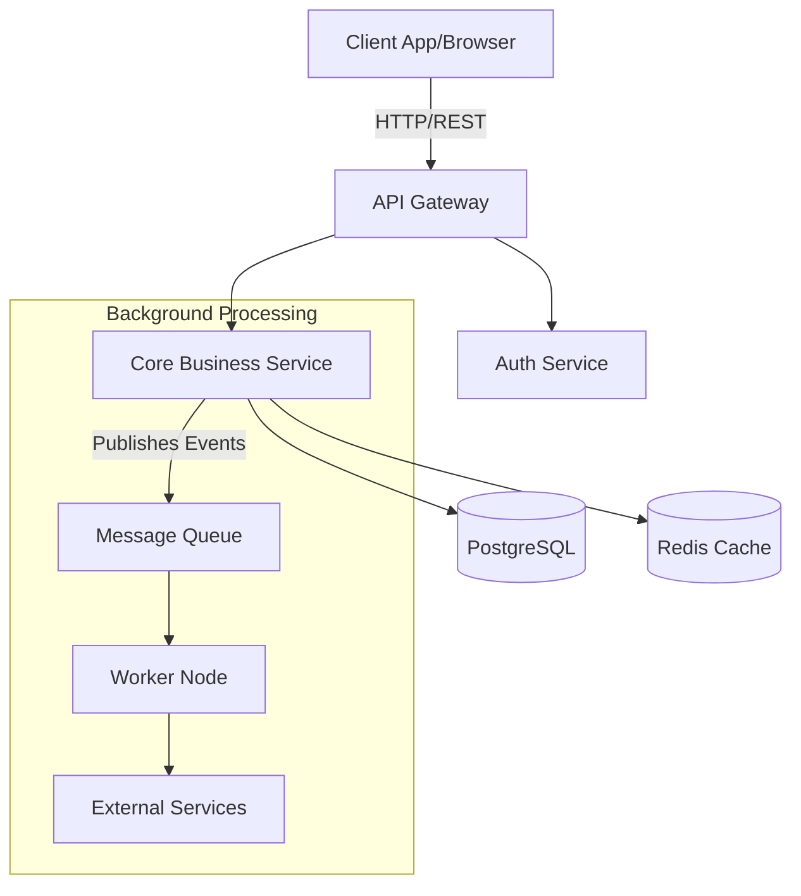

## 🏗 Architecture

Here is a high-level overview of the system architecture.

_This diagram is generated using Mermaid.js. It allows developers to update the architecture directly in the markdown file._
